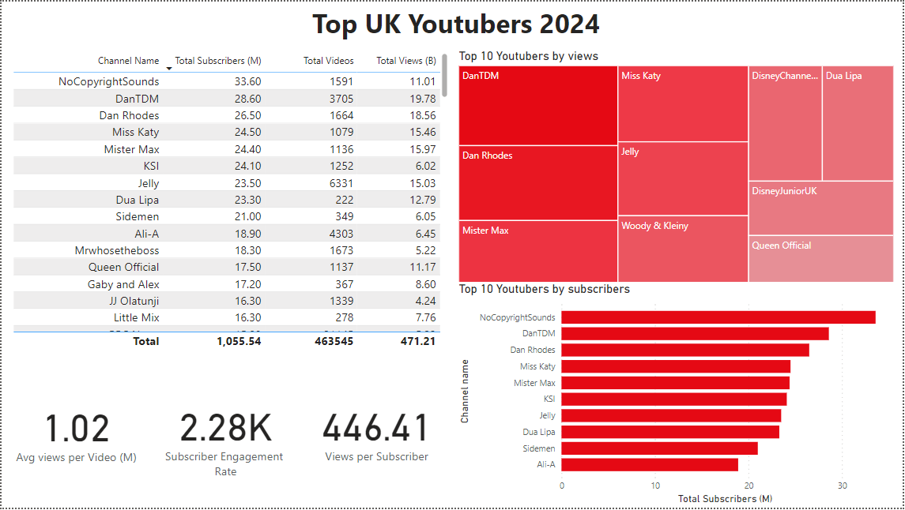

# Data porfolio

This is my porfolio website!


# Table of contents 

- [Objective](#objective)
- [Data Source](#data-source)
- [Stages](#stages)
- [Design](#design)
  - [Mockup](#mockup)
  - [Tools](#tools)
- [Development](#development)
  - [Pseudocode](#pseudocode)
  - [Data Exploration](#data-exploration)
  - [Data Cleaning](#data-cleaning)
  - [Transform the Data](#transform-the-data)
  - [Create the SQL View](#create-the-sql-view)
- [Testing](#testing)
  - [Data Quality Tests](#data-quality-tests)
- [Visualization](#visualization)
  - [Results](#results)
  - [DAX Measures](#dax-measures)
- [Analysis](#analysis)
  - [Findings](#findings)
  - [Validation](#validation)
  - [Discovery](#discovery)
- [Recommendations](#recommendations)
  - [Potential ROI](#potential-roi)
  - [Potential Courses of Actions](#potential-courses-of-actions)
- [Conclusion](#conclusion)


# Objective

- What is the main objective of this project ?
  
  An American Company wants to run an advertisment campaign through Youtube in UK in order to penetrate a new market. The Marketing Team want to find the best UK Youtuber in 2024 they can work with in 2024.

- What is the decision making support ?

  The best solution to support the stakeholders is to create a dashboard that provides strong insight about UK Youtubers:
  
  - Total subscribers
  - Total views
  - Total videos
  - Viewer engagement
  - etc.
  

## User Assignement
  As the Head of the Marketing Team, I want to have access to a dashboard that include the best insights in order to collaborate with the best UK Youtuber in 2024.
  This dashboard should include strong metrics like the average views, subscribers engagement and many more. I want to choose the best performing UK Youtuber to collaborate with to penetrate the UK market.

# Data Source

  The data is coming from a CSV file sourced from Kaggle. Url: [https://www.kaggle.com/datasets/bhavyadhingra00020/top-100-social-media-influencers-2024-countrywise?resource=download].

# Steps of the project

  - Design the dashboard
  - Developement (Explore data, Clean data and Validate data)
  - Testing
  - Vizualisation
  - Analyzing data
  - Recommendation

# Design 

## Dashboard requirements
  - What are the dashboard requirements based on the information provided:

    1. Who are the top 10 YouTubers with the most subscribers?
    2. Which 3 channels have uploaded the most videos?
    3. Which 3 channels have the most views?
    4. Which 3 channels have the highest average views per video?
    5. Which 3 channels have the highest views per subscriber ratio?
    6. Which 3 channels have the highest subscriber engagement rate per video uploaded?

## Dashboard Mockup

  - Based on the information provided we need to create a dashboard with the following visuals:

|Visuals|
|---|
|A Table with the most important information|
|A Treemap|
|Scorecard with strong insights|
|An horizontal bar chart|

## Tools

  Which tool will be used to complete this project?

| Tools | Purpose |
| --- | --- |
| Excel | To explore data |
| SQL Server | To clean, validate and analyze the data |
| Power Bi | To create an interactive visualization |
| Google Sheets | To manipulate and calculate information from insights |
| Github | To host and present the project documentation |

# Developement

## Pseudocode: Steps of the developement section

  - This are the main steps that will be followed in order to complete the project:

    1. Load data to Excel.
    2. Explore data in Excel.
    3. Load data into SQL Server.
    4. Clean data with SQL.
    5. Test data with SQL.
    6. Load data into Power Bi.
    7. Visualize data in Power Bi.
    8. Compare Power Bi insights with Excel insights done with calculation.
    9. Provide a recommendation and final conclusions based on insights.

## Data Exploration
  - In this section, we will take a look at the raw dataset by using Excel. We will identify the errors, missplealled words, weird characters, etc.

  - During the data exploration we identified the followings:
    1. We observe that some columns names might be in a different language.
    2. Some of the columuns are important for our project.
    3. It seems that the channel id and channel name is separated with an @.
    4. Some of the columns present in the dataset are unessesary for our project.
   
## Data Cleaning, Transfomration and Quality Check
  - SQL Server Management (or SSMS) is used un order to clean data, transform and run quality checks.

  - This are the step to follow in order to clean the data properly for our project:
    1. Select only the columns that are necessary for the project.
    2. Extract the channel name from the first column.
    3. Rename the column names.
    4. Do a row check to verify if there's 100 rows of data.
    5. Do a column check id there'is 4 columns fields.
    6. Do a data type check if the correct data type is assign to the correct field.
    7. Do a null check. It's important to have a complete dataset without any null data.

### Data Cleaning

#### Select columns
```sql
/*

--Selecting colums we need for the project

		select 
			NOMBRE,
			total_subscribers,
			total_views,
			total_videos
		from 
			top_uk_youtubers_2024;
```

### Extracting Youtube Channel Names

```sql
/*

--Extracting Youtube Channels

		select
			CHARINDEX('@', NOMBRE),
			NOMBRE
		from
			top_uk_youtubers_2024;
```

### Create a SQL View 
```sql
/*
1. Renaming Youtube channels colum name and creating a view with all data cleaned

		CREATE VIEW view_uk_youtubers_2024 AS
		SELECT 
			CAST(SUBSTRING(NOMBRE,1,CHARINDEX('@', NOMBRE)-1) AS varchar(100)) AS channel_name,
			total_subscribers,
			total_views,
			total_videos
		FROM
			top_uk_youtubers_2024;
```

### Testing and Quality Checks

### Row count test
```sql
/*

--Row count test

select 
	COUNT(*) as numbers_of_rows
from 
	top_uk_youtubers_2024;

```

### Column count test
```sql
/*

--Column count test

select 
	count(*) as columns_count
from 
	INFORMATION_SCHEMA.COLUMNS
where 
	table_name = 'view_uk_youtubers_2024';
```

### Data Type test
```sql
/*

--Data type test

select 
	COLUMN_NAME,
	DATA_TYPE
from 
	INFORMATION_SCHEMA.COLUMNS
where 
	table_name = 'view_uk_youtubers_2024';
```

### Duplicates Check
```sql
/*

--Duplicates check

select 
	channel_name,
	count(*) as duplicate_count
from 
	view_uk_youtubers_2024
group by
	channel_name
having
	Count(*) > 1
```

#Visualization

##Results 

 - This shows how the final dashboard looks like.




    


